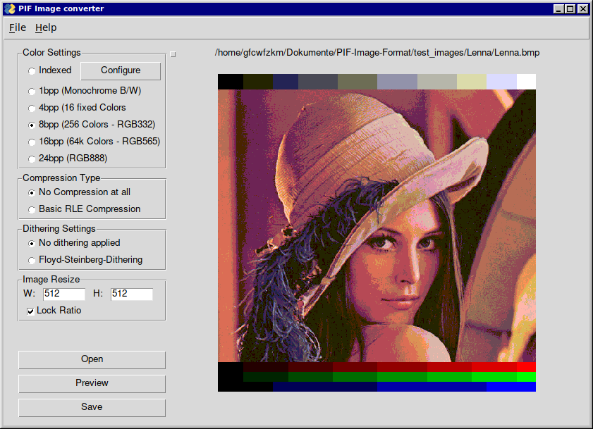

# PIF - «Portable Image File» Format
## Overview
The Portable Image Format (PIF) is a basic, bitmap-like image format with the focus on ease of use (implementation) and small size for embedded applications. The file format not only offers special, reduced color sets to reduce size where 24-bit resolution are not required (or unable to be rendered by the display), but also features variable sized color tables to achive good-looking, custom images at reduced bit-per-pixel size. To further reduce the size of the image data, a simple RLE-compression can be used without loosing too many cycles on decompression.

## Features
 - Various Bitformats supported:
   - RGB888 - Uncompressed RGB Image
   - RGB565 - 16bit per Pixel Image, reduced colorset
   - RGB332	- 8bit per Pixel Image, further reducing colors and size
   - RGB16C	- 4bit per Pixel Image, fixed Windows/IBM Style 16 colors
   - B/W - 1bit per Pixel Image, only Black and White
   - Indexed - Custom Pixel bitwidth and RGB888 color table
 - Basic Compression (RLE)
 - Ease of use and implementation

## Tools
### PIF Image Converter

A basic tool that allows to save various image formats (.jpg/.bmp/.png) to the .PIF Image Format. Within the program, various color settings can be applied with dithering, resizing the image as well as include the RLE compresison or not.
## Todo
We still have some steps ahead of us before this project can be considered finished. Here a rough overview of the things that are already done or that are still missing.
 - [ ] Image Converter
	- [x] Basic GUI implementation & preview
	- [x] Dithering Options
	- [x] Saving as .PIF
	- [ ] Custom (Indexed) options
	- [ ] Saving as .h Header
	- [ ] CLI Implementation
 - [ ] Image viewer
